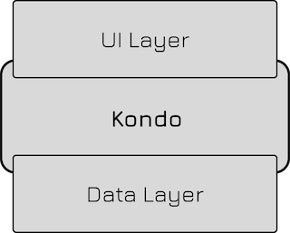
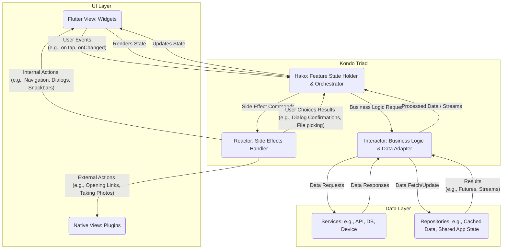

# Kondo 🧹

**The art of sweeping logic out of your UI.**

Kondo is an architecture pattern designed to bring strict organization, testability, and clarity to Flutter
applications. Kondo enforces a discipline of tidiness: **every piece of code has its own place.**

Built on top of the [hako](https://pub.dev/packages/hako) state management package, Kondo extends core state concepts
into a full architectural pattern. It decouples user interfaces from the logic that drives them, ensuring app features
are scalable, readable, and easy to test.

---

## Kondo's Place in Your Architecture 🏗️

Kondo doesn't sit neatly "between" layers—it **intercepts and orchestrates** the *feature layer* while its boundaries fade
gracefully into adjacent layers.

<br/>
<p align="center">
  
</p>

---

## The Philosophy: The "Kondo Triad" ♻️

Kondo structures every feature around a specific unit called the **Triad**. This separation ensures that business logic
never leaks into your UI, and state management never gets tangled with complex logic or data fetching.

### 1. 📦 Hako (The Orchestrator)

The **Hako** is the cornerstone of a feature. It is the central hub where everything connects.

* **Role:** It holds the single feature state and decides how to react to user inputs. It listens to events from the View, delegates
  complex work to the Interactor, and commands the Reactor to handle navigation.
* While it contains no Flutter widgets, the Hako is **aware of the View's interface**. It knows *what* state the UI
  needs to render and *which* events the UI can trigger.
* Typical Responsibilities:
    - Managing feature state
    - Coordinating between Interactor and Reactor
    - Handling user input events
    - Exposing state to the UI layer

### 2. 🧠 Interactor (The Business Logic)

The **Interactor** is the domain expert. It contains your application's pure business rules.

* **Role:** It performs calculations, processes data, and acts as the gateway to your external data layer.
* The Interactor is **stateless** and completely **unaware of the View interface**. It deals purely with data and domain
  rules. Because it acts as an **adapter** between your data and your feature, it keeps your core logic independent of
  specific UI implementations.
* Typical Responsibilities:
    - Business logic and data transformations
    - Communication with repositories and services (data layer)
    - Data validation and processing
    - Providing streams for reactive data sources

### 3. ⚡ Reactor (The Side Effects Handler)

The **Reactor** manages the boundaries of your feature.

* **Role:** It defines a contract for actions that affect the app environment rather than the pixels on the screen (e.g., navigation, app and system dialogs, launching URLs).
* It provides an abstract interface for side effects, which the View implementation fulfills using context-aware dependencies.
* Typical Responsibilities:
    - Navigation between screens
    - Showing snackbars, dialogs and bottom sheets
    - Triggering visual system-level actions
    - Handling several other Flutter context-dependent operation

---

## Architecture at a glance 🔍

The following diagram shows the complete flow of data and interactions within the Kondo architecture. Don't worry if it looks complex at first glance—it's intentionally detailed to serve as a reference as you learn. For now, just notice the three core components (Hako, Interactor, and Reactor) and how they sit between your UI and data layers. The specific arrows and flows will make more sense as you read through the individual explanations below.



---

## What is a "Feature"? 🧩

In Kondo, we use the word **Feature** constantly. But what exactly *is* a feature in a Flutter app?

A Feature is not just a screen (although there is often a correlation with it), or a portion of it.

**A Feature is a distinct unit of functionality that allows a user to complete a specific goal.**

Think of your app as a house.

* **Widgets** are the bricks and wood.
* The **App** is the entire house.
* **Features** are the rooms in the house.

Each room has a specific purpose. You go to the kitchen to cook. You go to the bedroom to sleep. You don't just have a "room with a table"; you have a dining room.

### Is it a Feature?

To decide if something is a Feature, ask: **"Can I name the user's goal?"**

* **Is "Button" a feature?** No. That’s a component.
* **Is "Profile" a feature?** Yes. The goal is to view or edit personal info.
* **Is "Login" a feature?** Yes. The goal is to gain access.
* **Is "Music Player" a feature?** Yes. The goal is to control playback.

### Features in Kondo

In Kondo, every Feature is self-contained. We don't build just "Screens" (or Panels); we build **Features**.

When you identify a Feature (e.g., `Kitchen`), Kondo gives you a standard "kit" to build it—the **Triad**:

1. **Hako:** The state of the room (Are the lights on? Is the music playing?).
2. **Interactor:** The logic of the room (How does the oven work? How do I fetch the recipe?).
3. **Reactor:** The doors and windows (How do I leave this room? How do I open a window?).

So Kondo is by design **feature-oriented**. By organizing your code into Features rather than technical layers, you keep your house tidy. When you need to fix the stove, you go straight to the kitchen (the Feature) and not to a generic pile of "hardware" (the Layer).

### Feature Folder Structure

A typical Kondo feature folder follows a predictable structure that makes navigation intuitive:

```
feature_name/
├── feature_name_view.dart              # The visual entry point
├── kondo/                              # The Triad lives here
│   ├── feature_name_hako.dart          # The Orchestrator [Hako]
│   ├── feature_name_interactor.dart    # The Business Logic [Interactor]
│   └── feature_name_reactor.dart       # The Side Effects Handler [Reactor]
└── widgets/                            # (Optional) UI subsections
    ├── feature_name_header.dart
    ├── feature_name_list.dart
    └── ...
```

**The `feature_name_view.dart`** is the visual entry point of your feature. It's the main screen or widget that users see. The View connects to the Hako to listen for state changes and dispatch user events. This is where you build your Flutter UI.

**The `kondo/` folder** houses the complete Triad—your feature's Hako, Interactor, and Reactor. By grouping these three files together, you immediately signal that this feature follows the Kondo architecture. All the logic, state management, and side effect handling live in this single, organized location.

**The `widgets/` folder** (optional) contains reusable UI components that are specific to this feature. These are subsections or building blocks of your main view—think of them as furniture in your room. They help break down complex UIs into manageable pieces while keeping them close to the feature they serve.

This structure ensures that everything related to a single feature stays together. When you need to work on the "Login" feature, you open the `login/` folder—not a scattered collection of files across different technical layers.

> **Note:** The data layer (repositories, services, data sources) typically contains fewer feature-specific components and more shared infrastructure. These components usually live elsewhere in your project structure—often in dedicated `data/`, `repositories/`, or `services/` folders—since they're designed to be reused across multiple features.

## Let's Write Our First Kondo Feature 🎯

Now that you understand the architecture, let's build something concrete. We'll create a simple **Counter** feature—the "Hello World" of state management—but structured the Kondo way.

### Step 1: Define Your Feature State

Every Hako manages multiple state objects. Let's just create the first one: `CounterSectionState`:

```dart
class CounterSectionState {
  const CounterSectionState(this.count, {this.isLoading = false});
  final int count;
  final bool isLoading;
}
```

### Step 2: The Interactor
The brain of the operation. It holds no state and knows nothing about Flutter widgets. It just computes data or talks to external Services/Repositories.

```dart
class CounterInteractor {
  CounterInteractor(this.analyticsService);
  
  final AnalyticsService analyticsService;

  // Business logic is pure
  Future<int> increment(int currentCount) async {
    // 1. Business logic happens here!
    final newCount = currentCount + 1;
    
    // 2. Side-operations (like logging) are transparent
    await analyticsService.logEvent('counter_incremented', {'count': newCount});
    
    // 3. Return 'Ready to consume' feature data
    return newCount; 
  }

  // Domain rules dictate boundaries
  bool isLimitReached(int count) => count >= 10;
}
```

### Step 3: The Reactor
The boundary to UI side effects. We don't want to capture raw `BuildContext` inside our logic layer, so we declare a contract of intents.

```dart
class CounterReactor {
  CounterReactor({required this.showLimitDialog});
  
  // We use a lazy closure for simplicity
  final Future<void> Function() showLimitDialog;
}
```

### Step 4: The Hako (Orchestrator)
Now we tie it all together. The Hako listens to the View, delegates pure work to the Interactor, triggers side effects in the Reactor, and natively updates the `CounterSectionState`.

```dart
import 'package:kondo/kondo.dart';

class CounterHako extends IRKondoHako<CounterInteractor, CounterReactor> {
  CounterHako({
    required super.interactor,
    required super.reactor,
  }) : super((register) {
          register(const CounterSectionState(0));
        });

  Future<void> onIncrementTap() async {
    final currentCount = get<CounterSectionState>().count;
    
    // Abstractly broadcast the UI loading intent
    set((_) => CounterSectionState(currentCount, isLoading: true));
    
    // Delegate domain logic and calculations completely to the Interactor
    final newCount = await interactor.increment(currentCount);
    
    // Update Orchestrator state and remove loading barrier
    set((_) => CounterSectionState(newCount, isLoading: false));
    
    // Delegate UI side effects based on domain rules
    if (interactor.isLimitReached(newCount)) {
      await reactor.showLimitDialog();
    }
  }
}

// Best Practice: Always provide a safe Context Extension for your views!
extension CounterHakoContextExtension on BuildContext {
  CounterHako get counterHako => readHako<CounterHako>();
  
  CounterSectionState watchCounterSectionState() => 
      watchHakoState<CounterHako, CounterSectionState>();
}
```

> **Note:** Kondo provides several Hako variants depending on your feature's complexity: `KondoHako` (no dependencies), `IKondoHako<I>` (Interactor only), `RKondoHako<R>` (Reactor only), and `IRKondoHako<I, R>` (full Triad). Here we use the most comprehensive variant. For simpler features that don't need business logic or side effects, the lighter variants avoid unnecessary boilerplate.

### Step 5: The View
Finally, map the architecture cleanly onto the widget tree using `KondoProvider`. It creates your Hako, provides it to all descendant widgets, and manages its full lifecycle—including automatic stream disposal when the feature is removed from the tree.

```dart
import 'package:flutter/material.dart';
import 'package:kondo/kondo.dart';

class CounterPage extends StatelessWidget {
  @override
  Widget build(BuildContext context) {
    return KondoProvider<CounterHako>(
      createHako: (context) => CounterHako(
        interactor: CounterInteractor(
          // Dependency Injection
          context.resolveDependency<AnalyticsService>(),
        ),
        reactor: CounterReactor(
          // Note: For simple setups this inline closure is fine. 
          // For scaled apps, migrate this into a dedicated Context-Aware DialogLauncher class.
          showLimitDialog: () async {
            if (!context.mounted) return;
            await showDialog(
              context: context,
              builder: (_) => const AlertDialog(title: Text('Limit Reached!')),
            );
          },
        ),
      ),
      builder: (context) => Scaffold(
        appBar: AppBar(title: const Text('Kondo Counter')),
        body: Center(
          child: Builder(
            builder: (context) {
              // Here we restrict the rebuild geometry to ONLY this specific section.
              final state = context.watchCounterSectionState();

              return state.isLoading
                  ? const CircularProgressIndicator()
                  : Text('Count: ${state.count}');
            },
          ),
        ),
        floatingActionButton: FloatingActionButton(
          // Call events strictly formulated via intent ('onIncrementTap')
          onPressed: context.counterHako.onIncrementTap,
          child: const Icon(Icons.add),
        ),
      ),
    );
  }
}
```

---

## Dependency Injection Management 💉

Kondo enforces dependency injection to decouple UI logic from backend services. The framework provides an abstraction layer: `KondoDependencyResolver`. This allows you to plug in your preferred DI package (e.g., `kiwi`, `get_it`), or even use your own simple Map-based implementation, without permanently locking your core architecture to a third-party global singleton.

### Step 1: Implementation of the Resolver
Implement `KondoDependencyResolver` by wrapping your DI container. 
* **`Repositories` / `Services`**: Cache globally as **Singletons**.
* **`Interactors`**: Inject generically as **Factories** (created fresh per view).

```dart
import 'package:kiwi/kiwi.dart';
import 'package:kondo/kondo.dart';

class MyDependencyResolver implements KondoDependencyResolver {
  MyDependencyResolver() : _container = KiwiContainer() {
    _container.registerSingleton((c) => AnalyticsService());
    _container.registerFactory((c) => CounterInteractor(c.resolve()));
  }

  final KiwiContainer _container;

  @override
  T resolve<T>() => _container.resolve<T>();

  @override
  Future<void> dismantle() async {
    _container.clear();
  }
}
```

### Step 2: Injecting the Provider
Wrap your application (or a scoped feature branch) with `KondoDependencyProvider` to make the resolver accessible through the context:
```dart
void main() {
  runApp(
    KondoDependencyProvider(
      createResolver: (context) => MyDependencyResolver(),
      child: MyApp(),
    ),
  );
}
```

---

## Safe Side-Effects with ContextAwareAdapter 🛡️

What happens when your Interactor executes a long-running asynchronous operation and attempts to trigger a UI action afterwards? If the user has navigated away in the meantime, the `BuildContext` is no longer valid and the Reactor's attempt to show a dialog or navigate will throw a `Deactivated Widget` error.

To solve this in a professionally decoupled, scalable way, Kondo introduces the `ContextAwareAdapter`. Instead of manually checking `if (!context.mounted)` everywhere, you construct reusable, memory-safe UI launchers.

### Step 1: Create a Reusable Launcher
Extend the `ContextAwareAdapter` to safely wrap actions like `showDialog` or `Navigator.push`.

```dart
import 'package:flutter/material.dart';
import 'package:kondo/kondo.dart';

class ContextAwareDialogLauncher extends ContextAwareAdapter {
  ContextAwareDialogLauncher({required super.contextResolver});

  // We use `String Function(BuildContext)` callbacks so text can be translated
  // seamlessly at the exact moment the dialog triggers!
  Future<void> launchInfoDialog({
    required String Function(BuildContext context) title,
  }) async {
    // tryRun strictly guarantees the interior closure only executes if the widget is still mounted
    await tryRun((context) async {
      await showDialog(
        context: context,
        builder: (_) => AlertDialog(title: Text(title(context))),
      );
    });
  }
}
```

### Step 2: Empowering the Reactor
Instead of demanding clunky closures that muddy the UI code, your `CounterReactor` just cleanly expects the launcher class instance.

```dart
class CounterReactor {
  CounterReactor({required this.dialogLauncher});
  
  final ContextAwareDialogLauncher dialogLauncher;
  
  Future<void> showLimitDialog() async {
    await dialogLauncher.launchInfoDialog(
      // The context callback guarantees translations work flawlessly here
      title: (context) => AppLocalizations.of(context).limitReachedMessage,
    );
  }
}
```

### Step 3: Dynamic Context Mapping
Down in your view's `KondoProvider`, you provide the context dynamically using an inline deferred resolution closure (`() => context`).

```dart
      createHako: (context) => CounterHako(
        interactor: context.resolveDependency<CounterInteractor>(),
        reactor: CounterReactor(
          // Safely passing the Context through a robust lazy loader!
          dialogLauncher: ContextAwareDialogLauncher(contextResolver: () => context),
        ),
      ),
```
This pattern permanently ensures UI boundaries are respected, making your Reactions fully unit-testable while completely eradicating memory leak context crashes.

---

## Safely Subscribing to Streams 🌊

One of the most complex bugs in state management arises from orphaned `StreamSubscription` logic failing to cancel when a user leaves the screen. Kondo destroys this boilerplate by natively managing stream lifecycles deep inside the `IRKondoHako`. 

Here is the complete data flow using Kondo:

### 1. The Repository (The Source)
A singleton repository listens to a local database or a network socket and emits global domain entities.
```dart
class ChatRepository {
  // We use terminology like 'get[x]Stream' to clearly define the return type
  Stream<List<Message>> getMessageStream() => webSocket.onMessagesReceived();
}
```

### 2. The Interactor (The Translator)
The Interactor grabs the domain stream and elegantly maps it into pure Feature logic, strictly ensuring it **never** instantiates its own `StreamController` objects (which would improperly hold memory state).
```dart
class ChatroomInteractor {
  ChatroomInteractor(this.chatRepo);
  final ChatRepository chatRepo;

  Stream<List<ChatBubble>> getChatBubbleStream() {
    return chatRepo.getMessageStream().map((messages) {
      return messages.map((m) => ChatBubble.fromDomain(m)).toList();
    });
  }
}
```

### 3. The Hako (The Orchestrator)
Inside your Hako constructor, you hook into the Interactor using one of two native helpers: `connectStream` OR `listenStream`. The Hako implicitly captures the stream, binds it, and automatically destroys it securely when the UI route is popped.

*   **`connectStream<T>`**: Use this when you want to pipe the incoming stream directly into a tracked `Semantic Section` State mapping.
*   **`listenStream`**: Use this when you need varying side-effects or heavy logic execution (like re-initializing another endpoint).

```dart
class ChatroomHako extends IRKondoHako<ChatroomInteractor, ChatroomReactor> {
  ChatroomHako({
    required super.interactor,
    required super.reactor,
  }) : super((register) {
          register(const ChatFeedState([]));
        }) {
          
    // METHOD A: Direct State Binding (Pipes stream updates directly to the UI setter)
    connectStream<ChatFeedState>(
      // We map the incoming stream directly to our typed UI Section State
      stream: interactor.getChatBubbleStream().map(ChatFeedState.new),
    );

    // METHOD B: Logic Execution (Triggers complex functions on data updates)
    listenStream(
      stream: interactor.getTypingIndicatorStream(),
      onData: (isTyping) {
        if (isTyping) {
          reactor.scrollToBottom();
        }
      },
    );
  }
}
```
With these helpers, your UI automatically mirrors your database in real-time without a single `StreamSubscription` variable littering the codebase!

---

## Advanced Documentation 📖

Once you are comfortable with the canonical flow mapping of the Triad above, dive into our Advanced Concept guides. These rulebooks were built to ensure your Kondo implementations never degrade into massive, fragile state monoliths.

*   🧠 **[The Base Interactor](docs/base_interactor.md)** - Handling streams, avoiding UI dependencies, and differentiating App State vs Feature State.
*   ⚡ **[The Base Reactor](docs/base_reactor.md)** - Deep dive into Context-Aware Adapters and natively shielding against `Deactivated Widget` crashes.
*   🛡️ **[Context-Aware Adapters](docs/context_aware_adapters.md)** - Understanding Composition vs Inheritance for pure UI testability.
*   🧩 **[Internal State Structure](docs/internal_state_structure.md)** - When to use "Smart Wrappers" vs strictly mapping "Pure Data" structures.
*   📝 **[Structuring State](docs/structuring_state.md)** - The critical rules of Semantic Sectioning and why string-labels for state lookup are a total anti-pattern.
*   🏠 **[State Ownership](docs/state_ownership.md)** - Deciding whether state belongs in a Repository, an Ancestor Hako, or a Leaf Hako based on scope in the widget tree.
*   🏷️ **[Naming Event Handlers](docs/naming_event_handlers.md)** - The mandatory `on+[Subject]+[Trigger]` scheme allowing codebases to remain perfectly agnostic to widget changes.
