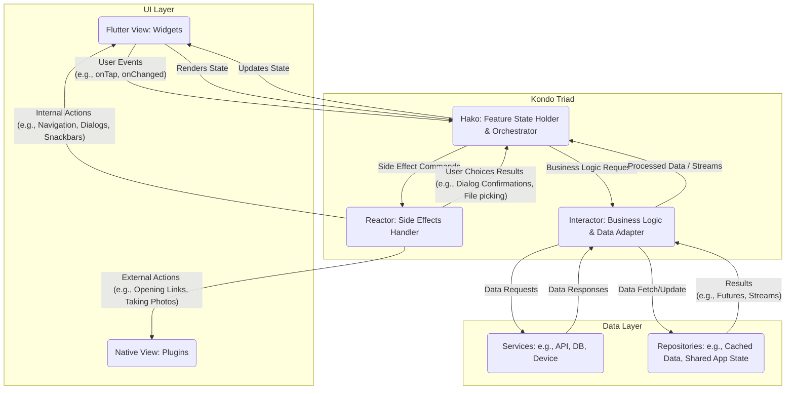

# Kondo Architecture Flowchart 🔍

This document provides the full, detailed architecture flow for the **Kondo** pattern, including component responsibilities and interaction flows across layers.

## Interactive Flow Diagram

---

## Flow Breakdown

1. **User Interaction**:
   - The user interacts with the UI (`Flutter View`), triggering **User Events** into `Hako`.
2. **Business Delegation**:
   - `Hako` delegates domain and business tasks by making **Business Logic Requests** to the `Interactor`.
3. **Data Access**:
   - `Interactor` fetches or mutates data via **Services** (APIs, Database, Device) and **Repositories** (Cache, Shared App State).
   - Responses and streams flow back from the data layer into the `Interactor`, which transforms them into domain-appropriate models and streams for `Hako`.
4. **State Orchestration**:
   - `Hako` receives processed data, updates the feature state, and emits state updates to the `Flutter View`.
5. **Side Effects**:
   - When actions require navigation, dialogs, snackbars, or external device plugins, `Hako` commands the `Reactor`.
   - The `Reactor` executes context-aware side effects directly against `Flutter View` or native system plugins, returning any user choices (such as dialog confirmations or file picking) back to `Hako`.
